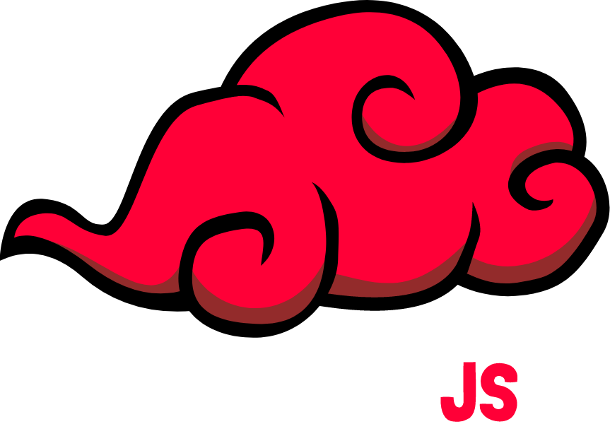

import { Head, Appear } from 'mdx-deck'
export { default as theme } from './theme'
import { Flex, Box } from '@rebass/grid'
import { CodeSurfer } from "mdx-deck-code-surfer"

<Head>
  <title> AkatsukiJS: hue hue br </title>
  <link href="https://fonts.googleapis.com/css?family=Dosis|Londrina+Solid|Roboto+Slab" rel="stylesheet" />
</Head>

# Akasuki JS: só de zoas

---

<Flex alignItems="center" justifyContent="space-between">
  <Box width={1/2} px={4}>

   

  </Box>
  <Box width={1/2} px={2} css={{textAlign: 'left'}}>

> Site: https://akatsuki.js.org

> Github: https://github.com/akatsukijs

> _"Só de zoas"_

  </Box>
</Flex>

---
## Sobre mim

- ### Fulano hue hue

- Entusiasta de alguma coisa, bla bla bla

---
## O que é _?

O simbolo '_' é chamado de Hole

Quer dizer que a variável não vai ser usada

---
##  Testando o appear

<Appear>
  
 vue 

  
 react 

  
 inferno 

  
 angular 

</Appear>

---

<CodeSurfer
  title="HueHue Title"
  code={require("!raw-loader!./snippets/my-snippet.js")}
  lang="javascript"
  showNumbers={false}
  dark={false}
  steps={[
    { notes: "A hue hue note"},
    { lines: [2], notes: "Note for the first step" },
    { range: [3, 4] },
    { tokens: { 9: [4, 5] }, notes: "Note for the third step" }
  ]}
/>

---
# LIBs

> Lodash

> Redux

> React

---
## Perguntas

Perguntem agora ou calem-se para sempre

---
## Referencias

- Stackoverflow

- Wikipedia

- Não preciso de Referencias

---
# 
<Flex alignItems="center" justifyContent="center">
<Box width={1/2} >

</Box>

</Flex>